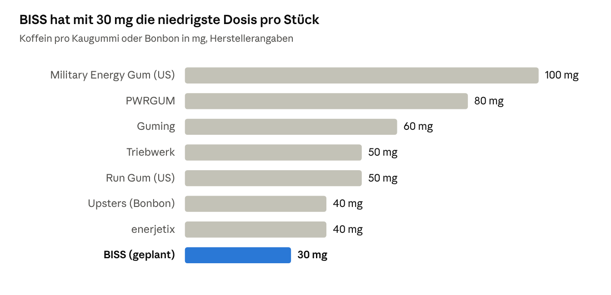
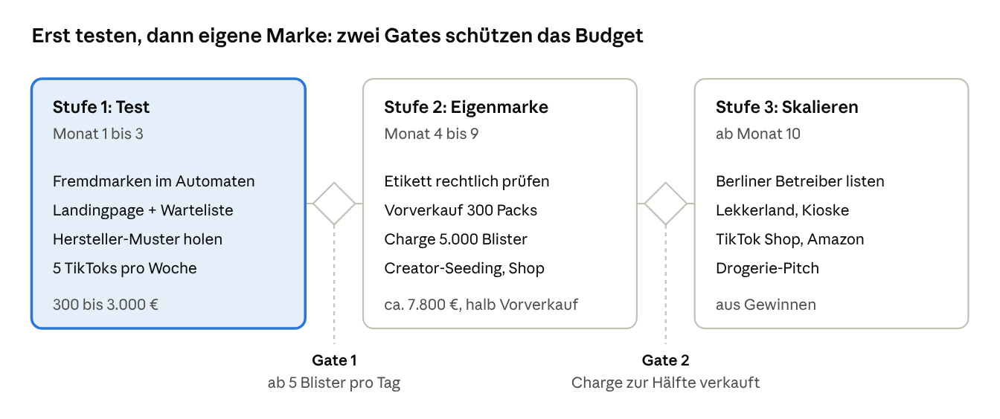

# Businessplan: Funktionale Snacks für Automaten

Oct 8, 2026 · @Daniel

## Kurzfassung

**Aktualisiert nach dem BISS Launch-Plan:** Drei Erkenntnisse ändern diesen Plan. Erstens ist der Name BISS markenrechtlich riskant, Plan A ist jetzt SPÄTKAU. Zweitens läuft der Pilot mit der fertigen Guming-Metalldose (250 Stück, ca. 2.100 € Gesamtbudget) statt mit einer eigenen Charge. Drittens kostet die eigene 30-mg-Rezeptur ca. 20.000 €, weil Hersteller 20.000 bis 36.000 Stück verlangen.

**Fokus seit 08.10.2026: Coworkings und Büros, nicht Nachtleben.** Dort zahlen Firmen für Ausstattung, die Leute sind erwachsen und kommen jeden Tag wieder. Die Haltung ist „ehrlich über lange Bürotage“, nicht Hustle Culture. Die Sorten heißen jetzt Deadline (Eisminze), Deep Work (Yuzu), Standup (Cola-Limette) und Feierabend (ohne Koffein).

**Urteil: 5 von 10. Es lohnt sich als gestufter Test für wenige Tausend Euro, nicht als großer Sprung.** Der Automat ist dabei kein Geschäft für sich, sondern Testlabor und Content-Maschine. Das eigentliche Geschäft wäre eine eigene Marke: ein Koffein-Kaugummi mit Xylit, niedriger Dosis und Zahnpflege-Claim, Arbeitstitel **BISS**.

**Empfohlener Weg in drei Stufen, jede mit Abbruchkriterium:**

1. **Test ohne eigene Ware (Monat 1 bis 3):** Fremdmarken (Guming, Upsters, Triebwerk) über einen Automaten in Berlin verkaufen. Ziel: mindestens 5 Blister pro Tag. Kein Mindestbestellrisiko.
2. **Eigenmarke klein (Monat 4 bis 9):** Nur wenn Stufe 1 trägt. Erste Charge von höchstens ca. 5.000 Blistern bei einem EU-Hersteller, vorher Lebensmittelrechts-Check.
3. **Skalieren (ab Monat 10):** Berliner Automatenbetreiber, Lekkerland für Kioske, TikTok Shop, dann Drogerie.

**Ranking der Optionen:**

| Rang | Option | Lohnt sich (1 bis 10) | Kurz |
| --- | --- | --- | --- |
| 1 | Test: Fremdmarken-Koffein-Gum im Automaten | 7 | Billig, schnell, echte Daten |
| 2 | Eigenmarke BISS: Koffein-Xylit-Gum | 6 | Echte Lücke, aber Recht und Mindestmenge |
| 3 | Xylit-Gum ohne Koffein (Kantine, Kaugummiautomaten) | 5 | Legal einfach, aber wenig Aufregung |
| 4 | Elektrolyt-Sticks Eigenmarke (Gym) | 4 | Gute Marge, aber übersättigter Markt |
| 5 | Eigene Automaten als Hauptgeschäft | 4 | 300 bis 650 € Gewinn pro Automat und Monat, viel Fahrerei |
| 6 | Koffein-Pouches | 2 | Rechtliche Grauzone, Jugendschutz-Debatte |
| 7 | Hard Gum (Kieferlinie) | 2 | Kurzlebiger Trend, Kinder-Image |

Verworfen, weil nicht automatentauglich oder zu teuer: Meal Prep, Holy-Klon, Hydroxylapatit-Zahnpasta, Pilates-Zubehör, Vibrationsplatte, Black-Sesame-Latte.

Das Urteil stammt aus einer Pro/Contra-Debatte zweier unabhängiger Analysen: Die Pro-Seite gab 6 von 10, die Contra-Seite 3 von 10 für eine sofortige Eigenmarke und 6 von 10 für den Fremdmarken-Test.

## Markt und Lücke

Der Automatenmarkt ist groß, aber Snacks sind dort Nebensache, und funktionale Produkte fehlen fast ganz. In Deutschland stehen rund 621.000 Automaten, davon nur 93.000 für Snacks und Food ([BDV Marktüberblick 2025](https://www.bdv-vending.de/wp-content/uploads/2025/03/bdv_Marktueberblick__Dt_2025.pdf)).

| Kennzahl (Datenjahr 2024) | Wert | Quelle |
| --- | --- | --- |
| Automaten gesamt | ca. 621.000 | [BDV](https://www.bdv-vending.de/wp-content/uploads/2025/03/bdv_Marktueberblick__Dt_2025.pdf) |
| Umsatz Getränke und Snacks | ca. 3,37 Mrd. € (gesamt 4,62 Mrd. €) | [Gastrospiegel](https://www.gastrospiegel.de/news/43-weitere-news/2605-03-12-2024-bdv-vending-markt-studie-2024-studie-zeigt-wachstum-und-verlagerungen-im-automatenmarkt) |
| Snacks und Food: Anteil Automaten / Umsatz / Verkäufe | 15 % / 20 % / 9 % | [BDV](https://www.bdv-vending.de/wp-content/uploads/2025/03/bdv_Marktueberblick__Dt_2025.pdf) |
| Standorte | 51 % Produktion, 25 % Büro, 5 % Bildung, 6 % Klinik, 3 % Outdoor/24/7 | [BDV](https://www.bdv-vending.de/wp-content/uploads/2025/03/bdv_Marktueberblick__Dt_2025.pdf) |
| Marktstruktur | über 1.000 Betreiber, 8 Anbieter mit ca. 30 % Anteil | [Bundestag WD 02/2026](https://www.bundestag.de/resource/blob/1157042/WD-5-017-26-WD-4-011-26-WD-8-009-26.pdf) |

**Was das heißt:**

- Der Markt ist zersplittert. Viele kleine Betreiber entscheiden selbst, was in die Spirale kommt. Das ist der Einstieg für eine kleine Marke.
- Automaten stehen vor allem in Betrieben, Büros und Kliniken, also bei Schichtarbeit und langen Arbeitstagen. Genau dort braucht man Wachmacher.
- Im Automaten gibt es Koffein fast nur als Dose. Ein kleines, leichtes, lange haltbares Koffein-Produkt ohne Zucker gibt es dort praktisch nicht.

**Die Produktlücke:** Koffein-Kaugummis gibt es in Deutschland schon (Guming, Upsters, Triebwerk, enerjetix). Keiner kombiniert aber **100 % Xylit, klar angegebenes Koffein pro Stück und den zugelassenen Zahnbelag-Claim**. Die Nächsten dran sind zantomed (Xylit plus Guarana ohne mg-Angabe) und Birkengold Energy (als Zahnpflegekaugummi) ([beste-testsieger](https://www.beste-testsieger.de/produkte/zantomed-xylit-kaugummi/), [violey](https://www.violey.com/en/birkengold-xylitol-dental-care-chewing-gum-energy_p_53289.html)).

**Berliner Vorbilder, die zeigen, dass Automaten als Marketing funktionieren:**

- BraTee hat einen eigenen Kaugummiautomaten am Boxhagener Platz und ist inzwischen bei REWE gelistet ([staycation.berlin](https://staycation.berlin/2025/08/verrueckte-automaten-in-berlin-tattoos-pizza-sonnencreme/), [REWE](https://www.rewe.de/shop/p/bratee-kaugummi-bra-berry-23-5g/8862041)).
- Der „Schmockimat“ eines TikTokers in Göttingen macht bis zu 10.000 € Umsatz pro Woche, getragen von 3,5 Mio. Followern ([W&V](https://www.wuv.de/themen/media/wie-dieser-tiktoker-mit-snacks-10.000-euro-umsatz-pro-woche-macht)).
- Der VeedelMat in Köln verkauft nur Produkte regionaler Start-ups ([gruender.de](https://www.gruender.de/startups/gruender-geheimnis-veedelmat/)).

## Top-Produkte

Der Gewinner ist ein Koffein-Kaugummi mit Xylit in niedriger Dosis, weil er klein, haltbar, ohne Kühlung und mit einem legalen Gesundheitsargument verkaufbar ist. Alle anderen Produkte scheitern an Recht, Konkurrenz oder Automatentauglichkeit.

| Rang | Produkt | Zielgruppe | Warum | Haken |
| --- | --- | --- | --- | --- |
| 1 | **BISS Koffein-Gum** (30 mg, Xylit, 10er-Blister) | Coworkings, Startups, Freelancer, Agenturen | Lücke: niemand kombiniert Xylit, klare mg-Angabe und Zahnpflege-Claim. Koffein aus Kaugummi geht schneller ins Blut als aus Kapseln ([Kamimori 2002](https://www.ebi.ac.uk/europepmc/webservices/rest/search?query=EXT_ID:11839447&resultType=core&format=json)) | „Macht wach“ darf man nicht werben; Bitterkeit maskieren |
| 2 | **BISS Fresh** (ohne Koffein, 100 % Xylit) | Kantinen, Mensen, Büros, klassische Kaugummiautomaten | Darf den Zahnbelag-Claim voll nutzen, auch für Kinder, kein Warnhinweis | Wenig Story, viel Konkurrenz (Extra Professional, Dontodent) |
| 3 | **Elektrolyt-Sticks** Eigenmarke | Gym, Boulderhalle | Marge um 59 %, einfach herzustellen | Markt voll, Endkundenpreis bei dm nur ca. 0,18 € pro Stick |
| 4 | Fremdmarken im eigenen Automaten (Wasser, Red Bull, Proteinriegel) | alle | Bringen Frequenz in den Automaten | Kaum Marge, kein Markenaufbau |

**Bewusst aussortiert:**

- **Koffein-Pouches:** EU-weit regulatorische Grauzone, typisch ca. 200 mg pro Beutel, Kritik wegen Jugendlicher ([NutraIngredients](https://www.nutraingredients.com/Article/2026/02/12/authorities-play-catch-up-on-caffeine-energy-pouch-regulation), [PTA in Love](https://www.pta-in-love.de/?p=121668)). Snus-Optik schadet einer gesunden Marke.
- **Hard Gum:** Trend ohne Claim, wirkt wie Kinderprodukt.
- **Holy-Klon, Meal Prep, Pilates, Zahnpasta, Vibrationsplatte, Black Sesame:** nicht automatentauglich, zu kapitalintensiv oder Markt besetzt.

**Wichtig:** Koffeinprodukte nie in die klassischen Kaugummiautomaten in Wohnkiezen. Die werden vor allem von Kindern genutzt. Dort nur BISS Fresh.

## Eigenes Produkt: BISS

**Hinweis zum Namen:** BISS ist Arbeitstitel. „Biss“ beschreibt bei Kaugummi eine Eigenschaft, das DPMA könnte die Marke zurückweisen. Plan A ist SPÄTKAU, vor jedem Druck im Register prüfen und anmelden.

BISS ist „Koffein, das deinen Zähnen nicht schadet“: ein zuckerfreier Kaugummi mit Xylit und 30 mg Koffein pro Stück, verkauft im 10er-Blister für ca. 3 €. Der Name spielt auf „Biss haben“ an. Markenrecht beim DPMA vorher prüfen.

**Produkt:**

- **Dosis 30 mg pro Stück**, etwa eine halbe Tasse Kaffee. Bewusst niedriger als Guming (60 mg). Dadurch passt die Verzehrempfehlung „3x täglich nach dem Essen“ zu den EFSA-Grenzen (200 mg pro Einzeldosis, 400 mg pro Tag) ([BfR](https://www.bfr.bund.de/fragen-und-antworten/thema/fragen-und-antworten-zu-koffein-und-koffeinhaltigen-lebensmitteln-einschliesslich-energy-drinks/)).
- **Süße: überwiegend Xylit.** 100 % Xylit maskiert Koffein schlecht. Deshalb Xylit als Hauptsüße plus eine kleine Menge Steviol oder Sucralose. Folge: Wir nutzen **nicht** den Xylit-Zahnbelag-Claim, sondern den einfacheren Zuckerfrei-Claim (siehe unten).
- **Sorten zum Start:** Minze (Pflicht) und eine Überraschung, z. B. Yuzu oder Cola-Limette.
- **Format:** 10er-Blister in einer flachen Kartonhülle, 2,5 bis 3 cm dick maximal, damit er in Standard-Spiralen nicht verkantet.

**Erlaubte Aussagen auf der Packung:**

- „Zuckerfrei“ und „mit Xylit“
- „Zuckerfreier Kaugummi trägt zur Erhaltung der Zahnmineralisierung bei“, mit Pflichthinweis „mindestens 20 Minuten nach dem Essen oder Trinken kauen“ ([VO 432/2012](https://eur-lex.europa.eu/legal-content/EN/TXT/HTML/?uri=CELEX:32012R0432))
- Koffeingehalt in mg pro Stück, Warnhinweis für feste Lebensmittel mit zugesetztem Koffein „Enthält Koffein. Für Kinder und schwangere Frauen nicht empfohlen“ (LMIV Anhang III, Wortlaut vom Lebensmittelrechtler bestätigen lassen), Hinweis „kann bei übermäßigem Verzehr abführend wirken“
- Nicht erlaubt: „macht wach“, „mehr Fokus“, „bessere Konzentration“. Ein Energy-Pulver verlor genau damit vor dem LG Hamburg ([Händlerbund](https://ohn.haendlerbund.de/recht/urteile-entscheidungen/138050-gesundheitsversprechen-von-energy-drink-war-unzulaessig))

**Design-Idee, die im Automaten auffällt:**

- Mattschwarze Hülle mit einem großen, ehrlichen Etikett: **„30 mg. 0 g Zucker.“** Die Zahl ist das Logo.
- Auf der Rückseite eine **Koffein-Skala**: 1 Stück, 1 Espresso, 1 Dose Energy im Vergleich, in mg. Reine Fakten, kein Wirkversprechen.
- Jedes Stück im Blister mit einem kleinen Strich nummeriert, wie ein Tagesstreifen. Das macht die Dosis sichtbar und ist auf TikTok sofort erklärbar.
- QR-Code zur Laboranalyse jeder Charge. Transparenz ist der Gegenentwurf zu Energy-Drink-Marketing.
- Eigenes 3D-gedrucktes Display für Kassen und Coworkings, Verbindung zur bestehenden 3D-Druck-Nische.

**Hersteller (in dieser Reihenfolge anfragen):**

| Hersteller | Was | Mindestmenge | Quelle |
| --- | --- | --- | --- |
| Delica AG, Schweiz | Private Label, Funktions-Gum mit Koffein, eigene Xylit-Linie, Blister mit 9, 10 oder 12 Stück | auf Anfrage | [Delica PDF](https://delica.com/media/dmdjfsez/chewinggum_20240515_final.pdf) |
| Fertin Pharma, Dänemark | Funktions-Gum, fertige Koffein-Rezeptur für Handelsmarken | unbekannt | [StoreBrands](https://storebrands.com/fertin-pharma-boosts-product-innovation-caffeine-gum) |
| Jiachem Dentbio, China | Koffein-Gum OEM, ca. 0,52 bis 0,55 $ pro Einheit | ca. 36.000 Einheiten | [Accio](https://de.accio.com/plp/coffein-gum) |

China erst ab nachgewiesenem Abverkauf: 36.000 Einheiten kosten ca. 19.000 $ vor Fracht, Zoll und Labor, das Drei- bis Fünffache des Budgets.

## Stärken und Schwächen

Die Debatte endete bei 6 zu 3: Die Idee hat eine echte Lücke, aber Recht, Mindestmenge und deine Zeit sind die Killer-Risiken. Alle drei lassen sich mit dem Stufenplan begrenzen.

|  | Stärken | Schwächen |
| --- | --- | --- |
| Produkt | Niemand kombiniert Xylit, klare mg-Angabe und Zahnpflege-Claim. Klein, haltbar, keine Kühlung | Koffein ist bitter, Xylit allein maskiert das schlecht. Xylit ist giftig für Hunde, kann abführend wirken |
| Markt | Koffein-Gum wächst weltweit ca. 6 % pro Jahr, in DE kein klarer Kategorieführer ([WiseGuy](https://www.wiseguyreports.com/reports/caffeine-gum-market)). Vorbild NEURO in den USA mit ca. 8 Mio. $ Umsatz 2023 ([Bericht](https://www.asianhustlenetwork.com/news/neuro-the-gum-that-defied-shark-tank-is-now-an-8-figure-empire/)) | Kaugummi insgesamt stagniert in DE ([Marktreport](https://strategyh.com/de/report/gum-market-in-germany/)). Konkurrenz: Mate für 1,50 €, normaler Kaugummi für 1,29 € |
| Recht | Zuckerfrei-Claims sind EU-weit zugelassen und klar formuliert | Kein zugelassener Claim für „wach“ oder „Fokus“. Der Xylit-Zahnbelag-Claim nennt Kinder, Koffein ist für Kinder nicht empfohlen. Influencer-Werbung wird aktiv abgemahnt ([LZ](https://www.lebensmittelzeitung.net/politik/nachrichten/health-claims-more-nutrition-unterliegt-foodwatch-vor-gericht-180041)) |
| Geld | Rohertrag ca. 70 % im Automaten (3 € VK, ca. 0,90 € EK) | Mindestmengen in China ca. 19.000 $, bei EU-Herstellern unbekannt. Dazu Labor, LUCID, GS1, Versicherung, Design |
| Vertrieb | Eigener Automat liefert harte Daten und Content. Zersplitterter Betreibermarkt mit über 1.000 Firmen | Dein Produkt belegt nur 1 bis 2 Spiralen. Betreiber und Lekkerland listen keine unbekannte Marke ohne Abverkaufszahlen |
| Du | E-Commerce-Ausbildung, Content-Erfahrung, GbR existiert, Studium bringt Zugang zur Zielgruppe | Deine Community interessiert sich für 3D-Druck, nicht für Energy. Ausbildung, Studium, Meshcast und weitere Projekte laufen parallel |

**Wie der Plan auf die drei Killer-Risiken antwortet:**

1. **Abmahnung:** Den Xylit-Zahnbelag-Claim streichen, nur den Zuckerfrei-Claim nutzen. Etikett vorher 1 bis 2 Stunden von einem Lebensmittelrechtler prüfen lassen (ca. 300 bis 600 €). Schriftliches Creator-Briefing mit erlaubten Sätzen.
2. **Mindestmenge frisst Kapital:** Erst Fremdmarken testen. Eigenmarke nur in kleiner EU-Charge (höchstens ca. 5.000 Blister) oder als Etikett auf fertigem Bulk-Gum.
3. **Automat dreht nicht:** Abbruchkriterium vorher festlegen: unter 5 Blister pro Tag nach 6 Wochen heißt Stopp. Erst testen, dann kaufen.

**Zeitfrage ehrlich:** Das hier ist ein physisches Produkt mit Lager und Fahrten. Es braucht realistisch 8 bis 10 Stunden pro Woche. Wenn das neben Ausbildung, Studium und Meshcast nicht drin ist, lieber ein Projekt pausieren als alle halb machen. Der Partner aus der GbR könnte Automat und Logistik übernehmen.

## Wettbewerb und was wir lernen

More Nutrition ist kein direkter Wettbewerber: Es verkauft weder Kaugummi noch Energy-Dosen, Koffein steckt dort nur in Protein-Kaffeegetränken ([morenutrition.de](https://www.morenutrition.de/)). Gefährlich ist eher der Mutterkonzern The Quality Group (ESN, More, BUM Energy) mit über 1 Mrd. € Umsatz 2025, der jederzeit eine Energy-Linie bringen könnte ([LebensmittelPraxis](https://lebensmittelpraxis.de/industrie-aktuell/49365-nahrungsergaenzungsmittel-the-quality-group-steigert-umsatz-um-mehr-als-40-prozent.html)). Die direkten Gegner sind Guming, PWRGUM, Upsters und Neuro.

Alle anderen werben mit mehr Koffein. BISS setzt bewusst auf die kleinste Dosis, die man Stück für Stück steuert.

**Direkte Wettbewerber:**

| Marke | Format | Preis | Kanal | Was sie gut machen |
| --- | --- | --- | --- | --- |
| [Guming](https://guming.de/) (DE) | Kaugummi, Papierverpackung | ab 19,98 € Probierpack | Shop mit Abo (–11 %), ca. 3.500 Händler, Amazon | „1 Gum = 1 Tasse Kaffee“, sofort verständlich |
| [PWRGUM](https://startupvalley.news/de/pwrgum-energy-kaugummi/) (DE) | 7er-Pack, mit Guarana und Taurin | k. A. | online, Sport und Gaming | selbst finanziert, klare Szene |
| [Upsters](https://www.rewe.de/shop/p/upsters-koffein-bonbons-fruity-lime-12-stueck/7376372) (DE) | Bonbon, 12er-Dose | REWE | REWE, online | Community: Umfragen, jede DM wird beantwortet; „2 Minuten 2 Millionen“ |
| [Fyyl](https://startupvalley.news/de/fyyl-fyylgum/) (DE) | Guarana-Gum, plastikfrei | k. A. | online, Influencer | Nachhaltigkeit als Story |
| [Triebwerk](https://www.fuersie.de/kochen-backen/energy-kaugummis-erobern-den-markt-16236.html) (DE) | Kaugummi plus B12 | ca. 3,99 € | Amazon | günstig |
| [enerjetix](https://das.medpex.de/catalog/leaflets/16387047-lmiv.pdf) (BE) | 9er-Blister, als Nahrungsergänzung | Apotheke | Apotheke | seriös wirkend |
| [Neuro](https://neurogum.com/) (US) | Gum mit L-Theanin | ab 24,99 $ | eigener Shop, Amazon, liefert nach DE | 30 Tage Geld zurück, über 50 Mio. verkaufte Einheiten ([The Daily Meal](https://www.thedailymeal.com/1380008/where-is-neuro-shark-tank-now)) |
| [Run Gum](https://rungum.com/) (US) | 2er-Päckchen | ca. 1,87 $ pro Pack | Shop mit Abo | in der Laufszene verankert |
| [Military Energy Gum](https://militaryenergy.com/) (US) | 5er-Pack | ca. 1,28 $ pro Pack | Amazon | Herkunftsstory Militär |

**Was am Automaten daneben liegt:** Red Bull 0,25 l mit 80 mg ([caffeineinformer](https://www.caffeineinformer.com/caffeine-content/red-bull)), Monster 0,5 l mit 160 mg und 55 g Zucker ([Monster](https://www.monsterenergy.com/es-es/energy-drinks/monster-energy/original-green/)), Club-Mate 0,5 l mit 100 mg, das Berliner Szenegetränk ([caffeineinformer](https://www.caffeineinformer.com/caffeine-content/club-mate)), HOLY als Pulver mit über 150 Mio. € Umsatz in unter vier Jahren ([HOLY](https://weareholy.jobs.personio.de/job/2278512)) und BAGZ Koffein-Pouches für 2,95 € ([tabakdealer.de](https://tabakdealer.de/bagz/kautabak/bagz-energy-coffee-power-coffeine-boost)).

**Zehn Lektionen, die BISS übernimmt:**

1. **Gründer als Gesicht:** Christian Wolf wurde zum Gesicht von More Nutrition ([droptime](https://droptime.de/article/wer-ist-christian-wolf-der-more-nutrition-grunder-im-detail)). Daniel filmt sich selbst am Automaten.
2. **Creator nur auf Provision:** More startete 2020 mit ca. 100 kleinen Creatorn (2.000 bis 50.000 Follower) und 10 % Umsatzbeteiligung statt Fixhonorar ([Kolsquare](https://www.kolsquare.com/es/customer-stories/como-more-nutrition-se-convirtio-en-una-marca-de-mil-millones-gracias-al-marketing-de-influencers)). BISS: persönlicher Code, 10 bis 15 % Provision.
3. **Community vor Reichweite:** Creator nach Szene auswählen (Coworking, Startups, Freelancer), nicht nach Followern.
4. **Limitierte Sorten:** More bringt Limited Editions mit Datum ([droptime](https://droptime.de/produkt/more-chunky-flavour)). BISS: eine Berlin-Sorte pro Monat, nur im Automaten.
5. **Community sichtbar einbauen:** Upsters lässt Fans über Sorten abstimmen ([startupvalley](https://startupvalley.news/de/upsters-koffeinbonbons-vitamin-d-elektrolyten/)). BISS: nächste Sorte per Instagram-Umfrage.
6. **Eine Szene besetzen:** Run Gum gehört den Läufern, Military Gum dem Militär. BISS gehört dem Berliner Büroalltag: Coworking, Deadline, Calls.
7. **Ein Vergleich in Zahlen:** „1 Gum = 1 Kaffee“ (Guming) funktioniert. BISS: „3 Stück ≈ 1 Espresso“, nur als mg-Rechnung.
8. **Risiko für Käufer senken:** Neuro gibt 30 Tage Geld zurück, HOLY verschickt Proben. BISS: Probierpack mit 2 Stück im Vorverkauf.
9. **TV oder Presse als Turbo:** Für Upsters war „2 Minuten 2 Millionen“ ein Schub. Ab Stufe 3 bewerben.
10. **Kooperation statt Werbebudget:** Koro erreichte mit Roadsurfer ca. 3.000 Displays ([W&V](https://www.wuv.de/themen/marke/impact-trotz-sommerloch-koro-pusht-seine-marke-durch-kooperationen)). BISS: Coworkings, Startup-Büros und Gründer-Events als Partner.

**Was BISS nicht kopiert:**

- Keine Aussagen zu Fokus, Konzentration oder Leistung. Das LG Hamburg hat genau das einem Koffein-Pulver verboten ([LebensmittelPraxis](https://lebensmittelpraxis.de/industrie-aktuell/36821-gerichtsurteil-emporgy-werbung-fuer-energydrink-ist-unzulaessig.html)). Namen wie „Focus Gum“ oder „Smart Gum“ sind in Deutschland riskant.
- Keine Diät- oder Prozentversprechen ohne Beleg: Dafür wurde More Nutrition verurteilt ([Verbraucherzentrale NRW](https://www.verbraucherzentrale.nrw/pressemeldungen/presse-nrw/verbraucherzentrale-nrw-erfolg-vor-gericht-gegen-more-nutrition-92924)).
- Jeder Creator-Post wird als Werbung gekennzeichnet. Die Wettbewerbszentrale mahnte 2024 elf Lebensmittel-Influencer ab ([Lebensmittel Zeitung](https://www.lebensmittelzeitung.net/politik/nachrichten/unzureichende-werbekennzeichnung-wettbewerbszentrale-mahnt-influencer-ab-176614)).
- Kein Auftritt, der Jugendliche anspricht. HOLY wurde vom VKI genau dafür kritisiert ([Börse Express](https://www.boerse-express.com/news/articles/vki-warnt-vor-energy-drink-pulver-holy-energy-690604)).
- Tageshöchstmenge auf die Packung, so wie Upsters es macht.

## Vertrieb

In Automaten kommst du über drei Türen, in dieser Reihenfolge: erst ein Platz bei einem bestehenden Berliner Betreiber, dann ein eigener Automat an einem starken Standort, dann Listung bei Betreibern und Großhändlern mit echten Abverkaufszahlen.

**Berliner Ansprechpartner:**

| Wer | Was | Wie rein | Quelle |
| --- | --- | --- | --- |
| BERTI Automaten-Service (Marzahn) | Regionaler Betreiber, seit über 35 Jahren | Direkt anrufen, 1 bis 2 Spiralen gegen Kommission anbieten | [berti-automaten.de](https://www.berti-automaten.de/index.php) |
| TAS Berlin Vending | Full-Service mit Sielaff-Automaten | wie oben | [tas-berlin.de](https://tas-berlin.de/vending) |
| Snackki (Reinickendorf) | Stellt Automaten kostenlos auf („Volloperating“) | wie oben, auch als Standort-Vermittler | [snackki.com](https://www.snackki.com/) |
| URBANIS (BVG-Tochter) | Über 300 Automatenstandorte im BVG-Netz | Mail an info@urbanis-berlin.de, erst ab Stufe 3 | [urbanis-berlin.de](https://urbanis-berlin.de/ueber-uns/) |
| Studierendenwerk Berlin | Betreibt „Mensa-Spätis“ an FU, TU, BHT, EHB | Mail an mensen@stw.berlin, nach BISS als Produkt fragen | [stw.berlin](https://www.stw.berlin/mensen/spaetis.html) |
| Geile Warenautomaten GmbH | Automaten am Hbf und Gesundbrunnen (DB) | Erst ab Stufe 3, DB schreibt Standorte aus | [bahnhof.de](https://www.bahnhof.de/en/berlin-hauptbahnhof/shopping-and-eating/warenautomaten) |
| SpätiMat | Über 30 eigene 24/7-Standorte plus Franchise | Als Lieferant anfragen | [spaetimat.com](https://www.spaetimat.com/) |
| Kaugummiautomaten-Betreiber (Pascal Kruse u. a.) | Rund 400 Automaten in Berliner Kiezen | Nur BISS Fresh ohne Koffein | [goodnews](https://goodnews-magazin.de/kaugummiautomaten-kehren-zurueck/) |

**Eigener Automat (Stufe 1 bis 2):**

- Kaufen: neu ab ca. 3.400 € als Standgerät, generalüberholt ab ca. 3.250 €, Kartenterminal 495 bis 1.090 € ([DGA Berlin](https://www.dga-vending.com/de/collections/verkaufsautomat-kaufen-in-berlin), [DGA-Blog](https://www.dga-vending.com/de/blogs/aktuell/wie-viel-kostet-ein-verkaufsautomat)). Gebraucht über Kleinanzeigen günstiger.
- Bester Standort: Coworking oder Startup-Büro mit Inhaber, der direkt entscheidet. Öffentliche Häuser (Uni, Klinik) schreiben oft aus.
- Folierung in BISS-Optik macht den Automaten zum Werbeträger und Content-Motiv.

**Deutschlandweit (ab Stufe 3):**

- **Lekkerland** für Kioske und Tankstellen, ca. 40.000 Verkaufsstellen: Kurzporträt und Produktdaten an den Einkauf schicken ([lekkerland.de](https://www.lekkerland.de/sortiment/lieferant-werden/)).
- **Automatenfachgroßhandel** wie GEHO, der über 3.000 Artikel an Betreiber liefert ([automatenland.shop](https://automatenland.shop/pages/snacklieferant-fuer-automaten)).
- **Online:** eigener Shop mit Abo, Amazon (FBA ca. 2,50 € pro Stück in der kleinsten Größe, [ecomcalctools](https://ecomcalctools.com/blog/fees-amazon/amazon-fees-germany-2026/)) und TikTok Shop (9 % Provision, Neukunden 60 Tage 4 %, [Händlerbund](https://ohn.haendlerbund.de/themen/marktplaetze/gebuehrenerhoehung-tiktok-shop-haendler-zahlen-2026-mehr)). Ob Koffein-Gum dort als eingeschränkte Kategorie gilt, vorher im Seller Center prüfen.
- **Drogerie (dm, Rossmann)** erst mit Online-Traktion. Händler behalten grob 22 bis 30 % vom Regalpreis plus Aktionskosten ([eightx](https://eightx.co/blog/cpg-retail-distribution-margins), US-Richtwert).

## Zahlen

**Korrektur:** Eine eigene EU-Charge von 5.000 Blistern gibt es so nicht, die Mindestmengen liegen bei 20.000 Stück und mehr. Die Rechnung unten gilt deshalb erst ab Stufe 2 mit größerer Menge. Aktuelles Pilot-Budget im BISS Launch-Plan.

Die erste eigene Charge von 5.000 Blistern bringt ca. 3.000 € Gewinn, wenn sie innerhalb von 12 Monaten verkauft ist. Dafür braucht es im Schnitt ca. 14 verkaufte Blister pro Tag über alle Kanäle. Die meisten Einkaufspreise sind Annahmen und müssen durch echte Angebote ersetzt werden.

**Deckungsbeitrag pro 10er-Blister nach Kanal** (Annahme EK 1,10 € inkl. Verpackung bei kleiner EU-Charge, MwSt 7 %):

| Kanal | Preis | Abzüge | Deckungsbeitrag pro Blister |
| --- | --- | --- | --- |
| Eigener Automat | 3,00 € brutto | Kartengebühr ca. 2,4 % ([pulse-vending](https://pulse-vending.de/blog/erste-schritte/was-kostet-ein-snackautomat)), Standort 10 % | ca. 1,33 € |
| Online-Shop, 3er-Pack | 9,90 € brutto | Versand ca. 2 €, Zahlung ca. 0,35 € | ca. 1,20 € (ohne Werbung) |
| TikTok Shop, 3er-Pack | 9,90 € brutto | 9 % Provision, ca. 15 % Creator-Provision, Versand | ca. 0,50 € |
| Fremder Automatenbetreiber | Abgabe ca. 1,60 € netto | keine | ca. 0,50 € |
| Drogerie, Regal 2,99 € | Abgabe ca. 1,95 € netto | Händler ca. 30 %, Aktionen extra | ca. 0,85 € minus Aktionskosten |

**Investition nach Stufe:**

| Stufe | Posten | Betrag |
| --- | --- | --- |
| 1 Test | Platz bei Betreiber (Kommission) oder gebrauchter Automat plus Kartenleser, Fremdmarken-Ware, Landingpage | 300 bis 3.000 € |
| 2 Eigenmarke | Lebensmittelrecht 500 €, Labor 300 €, Design 800 €, GS1 60 € ([GS1](https://www.gs1-germany.de/en/prices/)), Versicherung ca. 150 €, Creator-Seeding 500 € | ca. 2.300 € |
| 2 Eigenmarke | Erste Charge 5.000 Blister à ca. 1,10 € | ca. 5.500 € |
| 3 Skalieren | Zweiter Automat, größere Charge, Messe/Listungsgespräche | aus Gewinnen |

**Rechnung Stufe 2:** 5.000 Blister × ca. 1,10 € Deckungsbeitrag im Mix = ca. 5.500 €. Minus 2.300 € Einmalkosten = **ca. 3.200 € Gewinn**. Die Ware selbst ist dabei schon bezahlt. Break-even der Einmalkosten liegt bei ca. 2.100 verkauften Blistern.

**Was ein Automat allein bringt:** In der Rechnung von heute ca. 330 € Gewinn pro Monat mit Klassikern, ca. 650 € mit funktionalem Mix, bei vorsichtigen 45 bis 62 € Umsatz pro Tag. Ein Betreiber berichtet 80 bis 150 € pro Tag als Normalfall ([getquin](https://app.getquin.com/de/post/kJiXqaBssQ/hier-mal-ein-kleines-update-zu-meinen-erfahrung-im-automaten-business)). Details in der Datei Snackautomat\_Rechnung.xlsx.

**Finanzierung ohne Kredit:** Vorverkauf über die Landingpage (Ziel 300 Vorbestellungen à 9,90 € = ca. 3.000 €) deckt gut die Hälfte der ersten Charge.

## Launch-Strategie

Jede Stufe startet nur, wenn das Gate davor erreicht ist. Wird ein Gate verfehlt, stoppst du mit kleinem Verlust statt mit einem Lager voller Kaugummi.

**Die Story, die alles trägt:** „Ich baue eine Energy-Marke, die deinen Zähnen nicht schadet, und stelle sie in Berliner Automaten.“ Ein eigener Account dokumentiert das öffentlich. Das ist dein Vorteil gegenüber Guming und Co.: Du verkaufst nicht nur ein Produkt, sondern eine Serie.

**Content-Formate (je 15 bis 45 Sekunden):**

- **Automaten-Tagebuch:** „Tag 12: so viel hat der Automat heute verkauft“, mit echten Zahlen.
- **Ehrlicher Vergleich:** Koffein und Zucker von BISS neben Energy-Dose und Espresso, nur Fakten in mg und g.
- **Behind the Scenes:** Muster vom Hersteller öffnen, Etikett entwerfen, 3D-gedrucktes Display bauen.
- **Büroalltag-Content:** Deadline am Freitag, Call-Marathon, Montagmorgen im Coworking. Kein „macht wach“, sondern Situationen zeigen.

**90-Tage-Plan für Stufe 1:**

1. **Woche 1 bis 2:** Drei Berliner Betreiber (BERTI, TAS, Snackki) und zwei Coworkings anfragen. Landingpage mit Warteliste bauen. Delica und Fertin um Muster und Mindestmengen bitten.
2. **Woche 3 bis 4:** Fremdmarken (Guming, Upsters, Triebwerk) bestellen und in 1 bis 2 Spiralen platzieren. Account starten, erste 5 Videos.
3. **Woche 5 bis 10:** Abverkauf pro Tag und Marke messen, Preis testen (2,50 € gegen 3,50 €). Warteliste über Content füllen, Ziel 500 Einträge.
4. **Woche 11 bis 12:** Gate 1 prüfen: mindestens 5 Blister pro Tag und 500 Wartelisten-Einträge. Erreicht → Etikett zum Lebensmittelrechtler, Charge bestellen, Vorverkauf starten. Nicht erreicht → stoppen oder Standort wechseln.

**Kennzahlen, die du wöchentlich trackst:** Blister pro Tag und Spirale, Wiederkäufer im Shop, Kosten pro Vorbestellung, Wartelisten-Wachstum.

## Recht und Risiken

Vor dem ersten Verkauf brauchst du sechs Dinge erledigt; alles ist machbar, aber nichts davon darf fehlen. Das ist keine Rechtsberatung, die Punkte sind mit einem Lebensmittelrechtler und eurem Steuerberater zu bestätigen.

- [ ] **Lebensmittelunternehmer registrieren** beim Veterinär- und Lebensmittelaufsichtsamt des Bezirks ([Bundestag WD](https://www.bundestag.de/resource/blob/1157042/WD-5-017-26-WD-4-011-26-WD-8-009-26.pdf)).
- [ ] **Einstufung klären:** normales Lebensmittel oder Nahrungsergänzungsmittel. enerjetix geht den NEM-Weg. Als NEM vor dem ersten Verkauf beim BVL anzeigen, seit 01.07.2026 nur noch online im Bundesportal ([BVL](https://www.bvl.bund.de/SharedDocs/Fachmeldungen/01_lebensmittel/2026/01_Fa_Anzeigeverfahren_NEM.html)).
- [ ] **Etikett nach LMIV:** Koffein in mg pro Stück, Koffein-Warnhinweis, Abführ-Hinweis wegen Xylit, Allergene, Hersteller- bzw. Inverkehrbringer-Adresse.
- [ ] **Claims:** nur „zuckerfrei“, „mit Xylit“ und der Zahnmineralisierungs-Claim mit 20-Minuten-Hinweis ([VO 432/2012](https://eur-lex.europa.eu/legal-content/EN/TXT/HTML/?uri=CELEX:32012R0432)). Den Xylit-Zahnbelag-Claim nicht verwenden: sein Wortlaut nennt Karies bei Kindern ([VO 1024/2009](https://eur-lex.europa.eu/legal-content/DE/TXT/HTML/?uri=CELEX:32009R1024)).
- [ ] **Verpackungsregister LUCID** und **GS1-Nummern** vor dem Verkauf.
- [ ] **Nebentätigkeit** mit CHECK24 abstimmen, falls der Ausbildungsvertrag das verlangt.

**Weitere Risiken:**

- **Werbung durch Creator:** Laut Verbraucherzentrale sind ca. 90 % der Influencer-Aussagen zu Nahrungsergänzung unzulässig ([Verbraucherzentrale](https://www.verbraucherzentrale.de/wissen/lebensmittel/nahrungsergaenzungsmittel/werbung-fuer-nahrungsergaenzungsmittel-durch-influencerinnen-123719)). Jeder Creator bekommt eine Liste erlaubter Sätze, Werbung wird gekennzeichnet.
- **Jugendschutz:** Koffein ist in DE nicht altersbeschränkt, aber TikTok erreicht viele Minderjährige. Kein Targeting unter 18, keine Platzierung an Schulen oder in Kiez-Kaugummiautomaten.
- **Hunde:** Xylit ist für Hunde giftig. Ein klarer Hinweis auf der Packung schützt Tiere und Marke.
- **Steuern:** Kaugummi als Lebensmittel meist 7 % MwSt, Getränke im Automaten 19 %. Mit dem Steuerberater klären, wie die GbR das abbildet.

## Nächste Schritte und Quellen

Mit diesen sechs Schritten startet Stufe 1 noch diese Woche.

- [ ] Entscheiden: 8 bis 10 Stunden pro Woche frei? Wenn nein, Partner aus der GbR fragen oder ein Projekt pausieren.
- [ ] BERTI, TAS Berlin und Snackki anfragen: 1 bis 2 Spiralen gegen Kommission für einen Koffein-Gum-Test.
- [ ] Delica (sales@delica.com) und Fertin anschreiben: Muster, Mindestmenge, Preis für 10er-Blister mit Xylit und 30 mg Koffein.
- [ ] Markenname BISS beim DPMA prüfen, Domain sichern.
- [ ] Landingpage mit Warteliste bauen (Claude Code).
- [ ] Offene Fragen an einen Lebensmittelrechtler sammeln: NEM oder Lebensmittel, Warnhinweis-Wortlaut, Claim-Kombination.

**Offen:** Mindestmengen und Preise der EU-Hersteller, Betreiber der Snackautomaten an FU, HU, TU und Charité, TikTok-Shop-Regeln für Koffein-Gum.

**Quellen:**

- [BDV Marktüberblick 2025](https://www.bdv-vending.de/wp-content/uploads/2025/03/bdv_Marktueberblick__Dt_2025.pdf)
- [Bundestag Wissenschaftliche Dienste 02/2026](https://www.bundestag.de/resource/blob/1157042/WD-5-017-26-WD-4-011-26-WD-8-009-26.pdf)
- [BfR: Koffein](https://www.bfr.bund.de/fragen-und-antworten/thema/fragen-und-antworten-zu-koffein-und-koffeinhaltigen-lebensmitteln-einschliesslich-energy-drinks/)
- [VO 1024/2009 Xylit-Claim](https://eur-lex.europa.eu/legal-content/DE/TXT/HTML/?uri=CELEX:32009R1024), [VO 432/2012 Zuckerfrei-Claims](https://eur-lex.europa.eu/legal-content/EN/TXT/HTML/?uri=CELEX:32012R0432)
- [BVL: NEM-Anzeige](https://www.bvl.bund.de/SharedDocs/Fachmeldungen/01_lebensmittel/2026/01_Fa_Anzeigeverfahren_NEM.html)
- [Delica Private Label](https://delica.com/media/dmdjfsez/chewinggum_20240515_final.pdf), [Fertin Koffein-Gum](https://storebrands.com/fertin-pharma-boosts-product-innovation-caffeine-gum)
- [Guming](https://guming.de), [enerjetix Etikett](https://das.medpex.de/catalog/leaflets/16387047-lmiv.pdf)
- [DGA Vending Berlin](https://www.dga-vending.com/de/collections/verkaufsautomat-kaufen-in-berlin), [pulse-vending Kosten](https://pulse-vending.de/blog/erste-schritte/was-kostet-ein-snackautomat)
- [Händlerbund: TikTok Shop Gebühren](https://ohn.haendlerbund.de/themen/marktplaetze/gebuehrenerhoehung-tiktok-shop-haendler-zahlen-2026-mehr), [Händlerbund: Energy-Claim-Urteil](https://ohn.haendlerbund.de/recht/urteile-entscheidungen/138050-gesundheitsversprechen-von-energy-drink-war-unzulaessig)
- [deutsche-startups: HOLY-Interview](https://www.deutsche-startups.de/2023/10/24/holy-interview-getraenke/)
- [W&V: Schmockimat](https://www.wuv.de/themen/media/wie-dieser-tiktoker-mit-snacks-10.000-euro-umsatz-pro-woche-macht), [staycation.berlin: Berliner Automaten](https://staycation.berlin/2025/08/verrueckte-automaten-in-berlin-tattoos-pizza-sonnencreme/)
